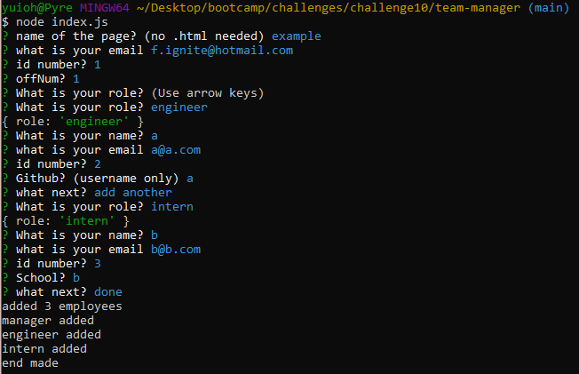

# team-manager
  ## description 
  this app creates an html webpage to help organize and manage a group of employees
  ## usage 
  to use the app open the file via git bash and run "npm i" then run the index.js file then answer the questions you are asked and when you are done select done   and you will find there is an html file in the 'dist' folder
  
  

  tutorial link:
  https://youtu.be/IJyY97jxh-A
